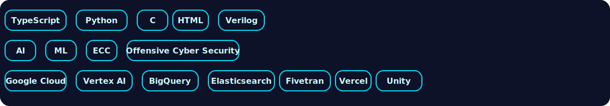
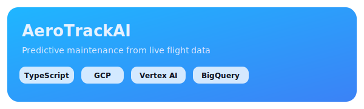
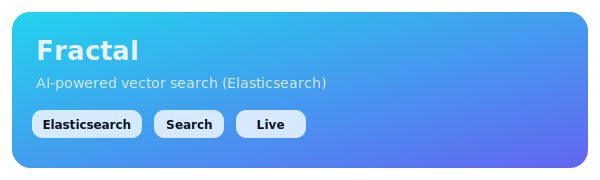
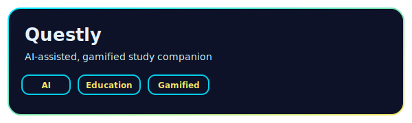

 <h1 align="center">Vidit Jain </h1>

 

  

## About Me

I'm driven by curiosity and a passion for learning. Each project is an opportunity to grow, whether I'm working with new algorithms, writing code, or understanding security principles. I believe in learning by doing and  continuously expanding my knowledge.

### Focus
- Building end-to-end AI and ML based projects with real data
- Exploring practical cybersecurity through hands-on labs

### Currently
- Growing my skills across all fields
- Working on projects that push me to learn new things
- Open to collaborations and learning from others

  

  

  

<h2 align="center">Featured Projects</h2>

  
  
  

  

 

 

<h2 align="center">Contribution</h2>

  <picture>
    <source media="(prefers-color-scheme: dark)" srcset="https://raw.githubusercontent.com/VIDITJAIN7/VIDITJAIN7/output/pacman-contribution-graph-dark.svg">
    <source media="(prefers-color-scheme: light)" srcset="https://raw.githubusercontent.com/VIDITJAIN7/VIDITJAIN7/output/pacman-contribution-graph.svg">
    
  </picture>

  

<h2 align="center">Stats</h2>
<table align="center">
  <tr>
    <td>
      
    </td>
    <td>
      
    </td>
  </tr>
  <tr>
    <td colspan="2" align="center">
      
    </td>
  </tr>
</table>
 

 
